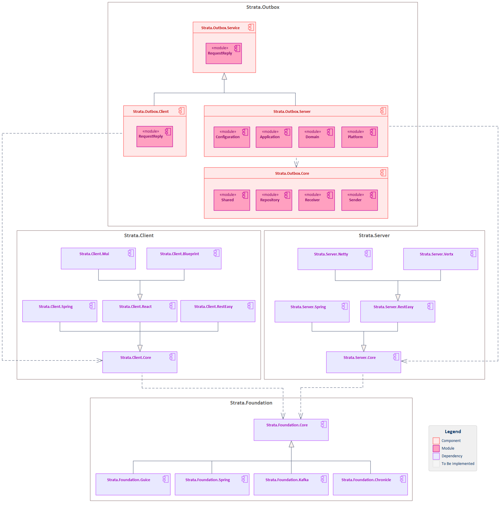

# Strata.Outbox

[]()
[]()

Transactional Outbox Pattern components and utilities for building robust, scalable enterprise microservices in the Strata Framework Set. This library provides core outbox abstractions, event publishing, reliable messaging, and enterprise patterns for building high-performance distributed applications with guaranteed event delivery.

## Features

- **Transactional Outbox Pattern**: Essential implementation for reliable event publishing with database transaction atomicity
- **Event Source Mapping**: Comprehensive support for converting domain objects to outbox events with custom mappers
- **Multiple Event Types**: Support for text messages, email messages, and service events with extensible event handling
- **Change Data Capture Integration**: Debezium CDC support for real-time event processing and delivery
- **Retry Logic**: Advanced retry mechanisms with exponential backoff and dead letter queue support
- **Spring Boot Integration**: Auto-configuration and Spring Security integration for enterprise applications
- **Database Support**: PostgreSQL and H2 database support with JPA/Hibernate integration
- **Event Processing**: Comprehensive event receivers and processors for handling outbox events

## Architecture

The Strata.Outbox framework follows a modular architecture with clear separation of concerns:



Each component builds upon the core outbox abstractions while providing specialized functionality for specific event publishing use cases and enterprise messaging patterns.

## Components

### Strata.Outbox.Core

The foundational outbox component that provides essential abstractions and utilities for enterprise event publishing:

**Modules:**
- `strata.outbox.core.repository` - Core outbox entity and repository abstractions
  - OutboxEvent entity for storing event data with retry tracking
  - IOutboxEventRepository interface for outbox data persistence
  - OutboxEventRepository implementation with JPA support
  - RepositoryConfiguration for database setup and configuration
- `strata.outbox.core.sender` - Event sender abstractions and implementations
  - AbstractOutboxEventSender base class for event publishing
  - ISourceToOutboxEventMapper interface for domain object to event conversion
  - OutboxEventTextMessageSender for SMS/text message publishing
  - OutboxEventEmailMessageSender for email notification publishing
  - OutboxEventServiceEventSender for inter-service event communication
  - TextMessageToOutboxEventMapper and EmailMessageToOutboxEventMapper implementations
  - ObjectMapperBasedSourceToOutboxEventMapper for generic JSON serialization
  - SendException for sender error handling
- `strata.outbox.core.receiver` - Event receiver abstractions and implementations
  - AbstractOutboxEventReceiver base class for event processing
  - IOutboxEventReceiver interface for event consumption
  - IOutboxEventReceiverMapProvider for receiver mapping and routing
  - TextMessageOutboxEventReceiver for processing text message events
  - EmailMessageOutboxEventReceiver for processing email events
  - ServiceEventOutboxEventReceiver for processing service events
  - ReceiveException for receiver error handling
- `strata.outbox.core.shared` - Shared utilities and common abstractions
  - MappingException for event mapping error handling
  - ObjectMapperProvider for JSON serialization configuration

### Strata.Outbox.Service

Service layer implementations providing business logic and event processing workflows for outbox operations:

**Features:**
- Business logic implementations for outbox event processing
- Service layer abstractions for event publishing workflows
- Integration patterns for enterprise service communication
- Event processing orchestration and coordination

### Strata.Outbox.Client

Client-side components and utilities providing outbox event consumption and processing capabilities:

**Features:**
- Client-side event consumption utilities
- Event processing clients for distributed systems
- Integration patterns for consuming outbox events
- Client-side error handling and retry mechanisms

### Strata.Outbox.Server

Server-side components providing outbox event publishing infrastructure and Change Data Capture processing:

**Modules:**
- Server-side event publishing infrastructure
- Debezium CDC integration for real-time event processing
- Event streaming and delivery mechanisms
- Spring Boot auto-configuration and enterprise integration
- Monitoring and observability hooks for event processing

## Installation

### Gradle

Add the following dependencies to your `build.gradle`:

```gradle
dependencies {
    implementation 'strata.outbox:strata-outbox-core:1.0-SNAPSHOT'
    implementation 'strata.outbox:strata-outbox-service:1.0-SNAPSHOT'
    implementation 'strata.outbox:strata-outbox-client:1.0-SNAPSHOT'
    implementation 'strata.outbox:strata-outbox-server:1.0-SNAPSHOT'

    // For testing
    testImplementation 'strata.outbox:strata-outbox-core-test:1.0-SNAPSHOT'
    testImplementation 'strata.outbox:strata-outbox-service-test:1.0-SNAPSHOT'
    testImplementation 'strata.outbox:strata-outbox-client-test:1.0-SNAPSHOT'
    testImplementation 'strata.outbox:strata-outbox-server-test:1.0-SNAPSHOT'
}
```

### Maven

Add the following dependencies to your `pom.xml`:

```xml
<dependencies>
    <dependency>
        <groupId>strata.outbox</groupId>
        <artifactId>strata-outbox-core</artifactId>
        <version>1.0-SNAPSHOT</version>
    </dependency>
    <dependency>
        <groupId>strata.outbox</groupId>
        <artifactId>strata-outbox-service</artifactId>
        <version>1.0-SNAPSHOT</version>
    </dependency>
    <dependency>
        <groupId>strata.outbox</groupId>
        <artifactId>strata-outbox-client</artifactId>
        <version>1.0-SNAPSHOT</version>
    </dependency>
    <dependency>
        <groupId>strata.outbox</groupId>
        <artifactId>strata-outbox-server</artifactId>
        <version>1.0-SNAPSHOT</version>
    </dependency>

    <!-- For testing -->
    <dependency>
        <groupId>strata.outbox</groupId>
        <artifactId>strata-outbox-core-test</artifactId>
        <version>1.0-SNAPSHOT</version>
        <scope>test</scope>
    </dependency>
    <dependency>
        <groupId>strata.outbox</groupId>
        <artifactId>strata-outbox-service-test</artifactId>
        <version>1.0-SNAPSHOT</version>
        <scope>test</scope>
    </dependency>
    <dependency>
        <groupId>strata.outbox</groupId>
        <artifactId>strata-outbox-client-test</artifactId>
        <version>1.0-SNAPSHOT</version>
        <scope>test</scope>
    </dependency>
    <dependency>
        <groupId>strata.outbox</groupId>
        <artifactId>strata-outbox-server-test</artifactId>
        <version>1.0-SNAPSHOT</version>
        <scope>test</scope>
    </dependency>
</dependencies>
```

### Repository Configuration

This package is published to GitHub Packages. Add the repository to your build configuration:

```gradle
repositories {
    maven {
        name "GitHubPackages"
        url "https://maven.pkg.github.com/StrataFrameworkSet/repository"
        credentials {
            username = project.findProperty("gpr.user") ?: System.getenv("USERNAME")
            password = project.findProperty("gpr.key") ?: System.getenv("TOKEN")
        }
    }
}
```

## Usage

### 1. Setting up OutboxEvent Receivers and Application Event Senders

#### Domain Event Receivers with Kafka Avro Senders

```java
import strata.outbox.core.receiver.ServiceEventOutboxEventReceiver;
import strata.outbox.core.sender.SendException;
import strata.foundation.kafka.event.IKafkaConfigurationProvider;

// Domain-specific event receiver that sends to Kafka with Avro serialization
public class UserEventOutboxEventReceiver
    extends ServiceEventOutboxEventReceiver<UserEvent, IUserEventSender>
{
    public UserEventOutboxEventReceiver(IUserEventSender sender)
        throws SendException
    {
        super(UserEvent.class, sender);
    }
}

public class SessionEventOutboxEventReceiver
    extends ServiceEventOutboxEventReceiver<SessionEvent, ISessionEventSender>
{
    public SessionEventOutboxEventReceiver(ISessionEventSender sender)
        throws SendException
    {
        super(SessionEvent.class, sender);
    }
}

public class SubscriptionEventOutboxEventReceiver
    extends ServiceEventOutboxEventReceiver<SubscriptionEvent, ISubscriptionEventSender>
{
    public SubscriptionEventOutboxEventReceiver(ISubscriptionEventSender sender)
        throws SendException
    {
        super(SubscriptionEvent.class, sender);
    }
}
```

#### Kafka Avro Event Senders using Strata.Foundation.Kafka

```java
import strata.foundation.kafka.event.KafkaAvroEventSender;
import strata.foundation.kafka.event.IKafkaConfigurationProvider;

public class KafkaAvroUserEventSender 
    extends KafkaAvroEventSender<UserEvent>
    implements IUserEventSender
{
    public KafkaAvroUserEventSender(
        IKafkaConfigurationProvider provider,
        String topicName)
    {
        super(provider, topicName);
    }
}

public class KafkaAvroSessionEventSender 
    extends KafkaAvroEventSender<SessionEvent>
    implements ISessionEventSender
{
    public KafkaAvroSessionEventSender(
        IKafkaConfigurationProvider provider,
        String topicName)
    {
        super(provider, topicName);
    }
}
```

#### Application Service with Outbox Event Publishing

```java
import strata.outbox.core.sender.OutboxEventEmailMessageSender;
import strata.outbox.core.sender.OutboxEventServiceEventSender;
import strata.outbox.core.repository.IOutboxEventRepository;

@Service
@Transactional
public class UserService {
    
    @Autowired
    private UserRepository userRepository;
    
    @Autowired
    private IOutboxEventRepository outboxRepository;
    
    @Autowired
    private OutboxEventEmailMessageSender emailSender;
    
    private OutboxEventServiceEventSender<UserEvent> userEventSender;
    
    @PostConstruct
    public void initialize() {
        // Create service event sender for domain events
        userEventSender = new OutboxEventServiceEventSender<>(
            new ObjectMapperBasedSourceToOutboxEventMapper<>(UserEvent.class),
            outboxRepository);
    }
    
    public void createUser(CreateUserRequest request) {
        // Save business data in same transaction
        User user = new User()
            .setEmail(request.getEmail())
            .setUsername(request.getUsername())
            .setStatus(UserStatus.ACTIVE);
        
        userRepository.save(user);
        
        // Publish domain event via outbox
        UserEvent userEvent = new UserEvent()
            .setUserId(user.getId())
            .setEmail(user.getEmail())
            .setUsername(user.getUsername())
            .setEventType("UserCreated")
            .setTimestamp(Instant.now());
        
        userEventSender.send(userEvent);
        
        // Send welcome email via outbox
        IEmailMessage welcomeEmail = createEmailMessage()
            .setTo(user.getEmail())
            .setSubject("Welcome to MyApp!")
            .setBody(generateWelcomeEmailHtml(user));
        
        emailSender.send(welcomeEmail);
    }
}
```

### 2. ServiceHost Application Configuration

#### Host Configuration Class

```java
import org.springframework.context.annotation.Bean;
import org.springframework.context.annotation.Configuration;
import org.springframework.context.annotation.Scope;
import org.springframework.scheduling.annotation.EnableAsync;
import org.springframework.transaction.annotation.EnableTransactionManagement;
import org.springframework.web.filter.CommonsRequestLoggingFilter;
import strata.foundation.core.configuration.IConfiguration;
import strata.foundation.core.inject.ApplicationConfigurationProvider;
import strata.foundation.kafka.event.IKafkaConfigurationProvider;
import strata.foundation.kafka.event.KafkaConfigurationProvider;
import strata.outbox.core.receiver.EmailMessageOutboxEventReceiver;
import strata.outbox.core.receiver.IOutboxEventReceiverMapProvider;
import strata.outbox.core.receiver.TextMessageOutboxEventReceiver;
import strata.outbox.server.configuration.StrataOutboxServerConfiguration;
import strata.server.core.inject.SecureEmailConfigurationProvider;
import strata.server.core.inject.SecureTextingConfigurationProvider;
import strata.server.core.notification.IEmailMessage;
import strata.server.core.notification.ITextMessage;
import strata.server.core.notification.JavaMailMessageSender;
import strata.server.core.notification.TeleSignMessageSender;

@Configuration
@EnableTransactionManagement
@EnableAsync
public class HostConfiguration extends StrataOutboxServerConfiguration {
    
    @Override
    @Bean
    public IOutboxEventReceiverMapProvider receiverMapProvider(IConfiguration configuration) {
        IKafkaConfigurationProvider kafkaProvider = 
            new KafkaConfigurationProvider(configuration);
        
        return () -> Map.of(
            // Handle email notifications with real email sender
            IEmailMessage.class.getSimpleName(),
            new EmailMessageOutboxEventReceiver(
                new JavaMailMessageSender(
                    new SecureEmailConfigurationProvider(configuration))),
            
            // Handle SMS notifications with real SMS sender
            ITextMessage.class.getSimpleName(),
            new TextMessageOutboxEventReceiver(
                new TeleSignMessageSender(
                    new SecureTextingConfigurationProvider(configuration))),
            
            // Handle domain events with Kafka Avro senders
            UserEvent.class.getSimpleName(),
            new UserEventOutboxEventReceiver(
                new KafkaAvroUserEventSender(
                    kafkaProvider,
                    "app.userevent.avro")),
            
            SessionEvent.class.getSimpleName(),
            new SessionEventOutboxEventReceiver(
                new KafkaAvroSessionEventSender(
                    kafkaProvider,
                    "app.sessionevent.avro")),
            
            UserProfileEvent.class.getSimpleName(),
            new UserProfileEventOutboxEventReceiver(
                new KafkaAvroUserProfileEventSender(
                    kafkaProvider,
                    "app.userprofileevent.avro")),
            
            SubscriptionEvent.class.getSimpleName(),
            new SubscriptionEventOutboxEventReceiver(
                new KafkaAvroSubscriptionEventSender(
                    kafkaProvider,
                    "app.subscriptionevent.avro"))
        );
    }
    
    @Bean
    @Scope("singleton")
    public IConfiguration configuration() {
        return new ApplicationConfigurationProvider("development").get();
    }
    
    @Bean
    public CommonsRequestLoggingFilter requestLoggingFilter() {
        CommonsRequestLoggingFilter filter = new CommonsRequestLoggingFilter();
        filter.setIncludeQueryString(true);
        filter.setIncludePayload(true);
        filter.setMaxPayloadLength(10000);
        filter.setIncludeHeaders(true);
        filter.setAfterMessagePrefix("REQUEST DATA: ");
        return filter;
    }
}
```

### 3. Spring Boot ServiceHost Application

#### Main ServiceHost Application Class

```java
import org.springframework.boot.SpringApplication;
import org.springframework.boot.autoconfigure.SpringBootApplication;
import org.springframework.boot.autoconfigure.jdbc.DataSourceAutoConfiguration;
import org.springframework.boot.autoconfigure.kafka.KafkaAutoConfiguration;
import org.springframework.boot.autoconfigure.security.servlet.SecurityAutoConfiguration;
import org.springframework.transaction.annotation.EnableTransactionManagement;

@SpringBootApplication(
    exclude = {
        DataSourceAutoConfiguration.class,
        SecurityAutoConfiguration.class,
        KafkaAutoConfiguration.class})
@EnableTransactionManagement
public class OutboxServiceHost {
    
    public static void main(String[] args) {
        SpringApplication application = new SpringApplication(OutboxServiceHost.class);
        application.setAdditionalProfiles("production");
        application.run(args);
    }
}
```

#### Application-Specific Event Senders and Configuration

```java
import strata.foundation.kafka.event.KafkaAvroEventSender;
import strata.foundation.kafka.event.IKafkaConfigurationProvider;
import strata.foundation.kafka.event.KafkaConfigurationProvider;
import strata.outbox.core.repository.IOutboxEventRepository;
import strata.outbox.core.sender.OutboxEventEmailMessageSender;
import strata.outbox.core.sender.OutboxEventTextMessageSender;
import strata.outbox.core.sender.OutboxEventServiceEventSender;

@Configuration
public class OutboxServiceConfiguration {
    
    @Bean
    public IKafkaConfigurationProvider kafkaConfigurationProvider(IConfiguration configuration) {
        return new KafkaConfigurationProvider(configuration);
    }
    
    @Bean
    public OutboxEventEmailMessageSender emailMessageSender(IOutboxEventRepository repository) {
        return new OutboxEventEmailMessageSender(repository, false);
    }
    
    @Bean
    public OutboxEventTextMessageSender textMessageSender(IOutboxEventRepository repository) {
        return new OutboxEventTextMessageSender(repository, false);
    }
    
    @Bean
    public KafkaAvroUserEventSender userEventSender(IKafkaConfigurationProvider kafkaProvider) {
        return new KafkaAvroUserEventSender(kafkaProvider, "app.userevent.avro");
    }
    
    @Bean
    public KafkaAvroSessionEventSender sessionEventSender(IKafkaConfigurationProvider kafkaProvider) {
        return new KafkaAvroSessionEventSender(kafkaProvider, "app.sessionevent.avro");
    }
    
    @Bean
    public UserEventOutboxEventReceiver userEventReceiver(KafkaAvroUserEventSender sender) 
        throws SendException {
        return new UserEventOutboxEventReceiver(sender);
    }
    
    @Bean
    public SessionEventOutboxEventReceiver sessionEventReceiver(KafkaAvroSessionEventSender sender)
        throws SendException {
        return new SessionEventOutboxEventReceiver(sender);
    }
}
```

#### Configuration Properties

```yaml
# application.yml
spring:
  application:
    name: outbox-service-host
  profiles:
    active: production
  datasource:
    url: jdbc:postgresql://localhost:5432/myapp_outbox_db
    username: ${DB_USERNAME:myapp_outbox_user}
    password: ${DB_PASSWORD:myapp_outbox_password}
    driver-class-name: org.postgresql.Driver
  jpa:
    hibernate:
      ddl-auto: validate
    properties:
      hibernate:
        dialect: org.hibernate.dialect.PostgreSQLDialect

# Kafka configuration for Avro event publishing
kafka:
  bootstrap-servers: ${KAFKA_BOOTSTRAP_SERVERS:localhost:9092}
  schema-registry:
    url: ${KAFKA_SCHEMA_REGISTRY_URL:http://localhost:8081}
  producer:
    key-serializer: org.apache.kafka.common.serialization.StringSerializer
    value-serializer: io.confluent.kafka.serializers.KafkaAvroSerializer
    retries: 3
    acks: all
  avro:
    topics:
      user-events: "app.userevent.avro"
      session-events: "app.sessionevent.avro"
      userprofile-events: "app.userprofileevent.avro"
      subscription-events: "app.subscriptionevent.avro"

# Email configuration for JavaMailMessageSender
email:
  smtp:
    host: ${SMTP_HOST:smtp.gmail.com}
    port: ${SMTP_PORT:587}
    username: ${SMTP_USERNAME}
    password: ${SMTP_PASSWORD}
    starttls: true

# SMS configuration for TeleSignMessageSender
sms:
  telesign:
    customer-id: ${TELESIGN_CUSTOMER_ID}
    api-key: ${TELESIGN_API_KEY}
    message-type: "ARN"
```

## Integration with Strata Framework

Strata.Outbox seamlessly integrates with other Strata Framework components:

- **Strata.Server**: For hosting outbox processors and providing notification abstractions
- **Strata.Client**: For consuming published events in client applications
- **Strata.Foundation**: For core utilities, patterns, and Kafka integration
- **Strata.Stream**: For advanced event streaming and processing scenarios

## Testing

The framework includes comprehensive test suites for all components. Tests use H2 in-memory database for fast execution:

```java
@SpringBootTest
@TestPropertySource(locations = "classpath:application-test.yml")
class OutboxEventSenderTest {
    
    @Autowired
    private IOutboxEventRepository outboxRepository;
    
    private OutboxEventTextMessageSender textMessageSender;
    
    @BeforeEach
    void setUp() {
        textMessageSender = new OutboxEventTextMessageSender(outboxRepository);
    }
    
    @Test
    @Transactional
    void shouldSaveEventWhenSendingTextMessage() {
        // Given
        ITextMessage message = createTextMessage()
            .setRecipient("+1234567890")
            .setMessage("Test message");
        
        // When
        textMessageSender.send(message);
        
        // Then
        List<OutboxEvent> events = outboxRepository.findAll();
        assertThat(events).hasSize(1);
        assertThat(events.get(0).getEventType()).isEqualTo("TextMessage");
        assertThat(events.get(0).getEventPayload()).contains("Test message");
    }
}
```

## License

This project is licensed under the Apache License 2.0 - see the [LICENSE](LICENSE) file for details.
